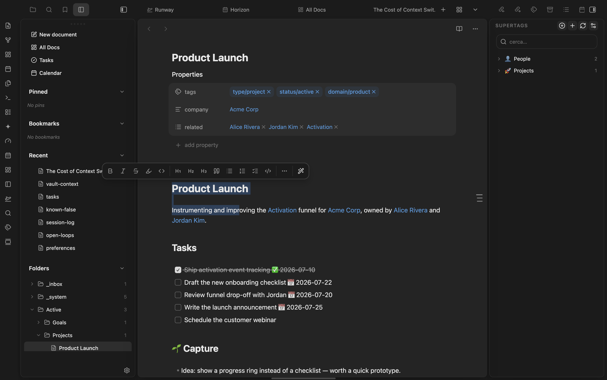
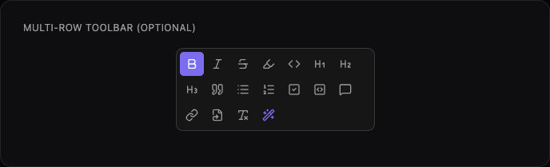
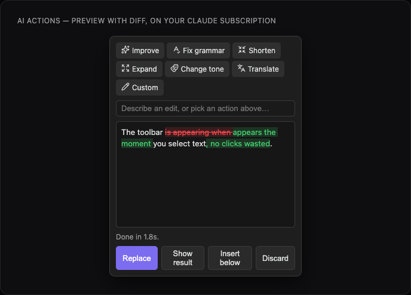
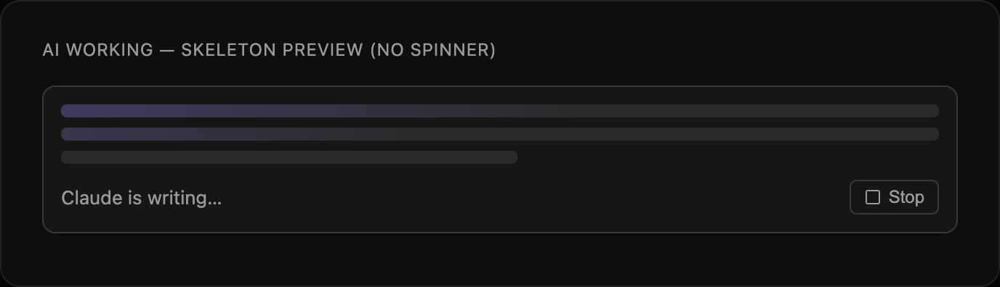
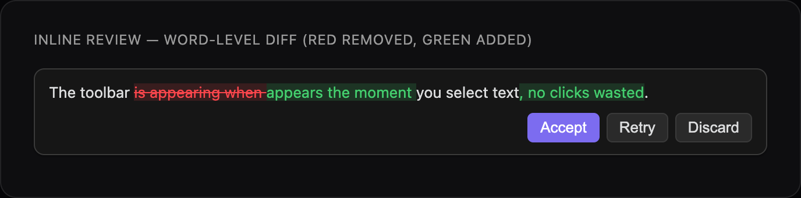

# Exo AI Selection Toolbar

A floating formatting toolbar for [Obsidian](https://obsidian.md) that appears when you select text in the editor — quick access to the most common Markdown commands, plus AI text actions powered by Claude. Desktop only.

The toolbar is themed entirely via Obsidian's CSS variables, so it matches your active theme (light, dark, or any community theme) automatically.

Part of the marioverse Obsidian plugin suite.











## Features

- **Inline formatting** (toggle on/off): bold, italic, strikethrough, highlight, inline code.
- **Block formatting**: H1–H3, blockquote, bullet / numbered / checkbox lists, code block, comment.
- **Insert**: link, internal `[[link]]`, clear formatting.
- **AI text actions** (✨): Improve, Fix grammar, Shorten, Expand, Change tone, Translate, and a free-form custom prompt — streamed from Claude.
- Configurable: enable/disable individual buttons, show delay, minimum selection length.

## How it works

**Formatting.** Select text → the toolbar floats above it → click a command. Wrap commands (bold, italic, …) toggle: click once to apply, again to remove. Block commands (headings, lists, quote, …) are mutually exclusive on a line. The toolbar is anchored to the selection with flip/shift, so it stays on-screen near the edges and follows you as you scroll.

**AI editing (✨).** Select text → click ✨ → a small panel anchors to the selection. Pick a preset (Improve, Fix grammar, Shorten, …) or type a free-form instruction and press Enter. The panel closes and the edit happens **inline, right in the note** (Notion-style):

1. A **skeleton** previews where the text is about to land while Claude starts (no spinner — it reads as "almost here").
2. The result **streams in live**, token by token, with a **Stop** button.
3. When it's done you get a **word-level diff** (red = removed, green = added) with **Accept** / **Retry** / **Discard**. Accept replaces the selection; Discard leaves it untouched. If the suggestion is identical to your selection, it says *"No changes suggested"* instead of showing an empty diff.

Nothing is written to your note until you press Accept. The whole flow is themed with your vault's CSS variables.

## Mobile

**Unsupported** — `isDesktopOnly: true` in `manifest.json`; `src/ai/client.ts` imports Node's `child_process`, `os`, `fs`, and `path` to spawn the local `claude` CLI, which isn't available on mobile.

## Installation

**Requirements:** Obsidian 1.4+ (desktop), and [Claude Code](https://www.anthropic.com/claude-code) installed and signed in (run `claude` once in a terminal). AI actions use your Claude subscription via the local CLI — no API key.

### Via BRAT (easiest today)

1. Install the **BRAT** community plugin.
2. BRAT → *Add beta plugin* → `mariomile/obsidian-selection-toolbar`.
3. Enable **Exo AI Selection Toolbar** under Community plugins. BRAT auto-updates it.

### Manual

1. Download `main.js`, `manifest.json`, and `styles.css` from the [latest release](https://github.com/mariomile/obsidian-selection-toolbar/releases/latest).
2. Copy them into `<your-vault>/.obsidian/plugins/selection-sidekick/`.
3. Reload Obsidian and enable the plugin.

> Community-plugins directory (one-click install) submission is planned — see below.

## AI actions & privacy

AI actions run through your **local [Claude Code](https://www.anthropic.com/claude-code) CLI**, using your existing Claude **subscription** — no API key and no metered API billing. They are **optional**.

- **Requirements**: Claude Code installed and signed in. Run `claude` once in a terminal to log in; the plugin then shells out to it.
- **No API key**: the plugin spawns `claude -p` and reuses your Claude Code login. Nothing is stored in `data.json` except your UI preferences.
- **Network use**: when you run an AI action, the **selected text** and your prompt are sent to Anthropic *through Claude Code* (which makes the request). The plugin itself opens no other network connections and collects no telemetry.
- **CLI path**: auto-detected via a login shell. If your `claude` lives somewhere unusual (e.g. under `nvm`), set the absolute path in settings (`which claude`).
- **Output modes**: *Preview* (the default — the edit appears inline in the note with a word-level diff and Accept/Discard) or *Direct* (stream straight into the editor, replacing the selection; `Cmd/Ctrl+Z` to undo).
- **Model**: defaults to Claude Code's configured model; `opus` / `sonnet` / `haiku` selectable in settings.
- **Note on terms**: using a subscription via Claude Code as a backend for another app is a gray area in Anthropic's usage terms — use for personal workflows and check your plan's terms.

## Development

```bash
pnpm install
pnpm dev      # esbuild watch — rebuilds on every save
pnpm build    # tsc typecheck + minified production build
```

By default the build outputs `main.js` to the project root. To auto-deploy into your vault during dev, point the build at your plugin folder with either:

- an env var: `OBSIDIAN_PLUGIN_DIR="/path/to/Vault/.obsidian/plugins/selection-toolbar" pnpm dev`, or
- a gitignored `.obsidian-plugin-dir` file in the project root containing that absolute path.

esbuild then copies `main.js`, `manifest.json`, and `styles.css` there on each build.

## Architecture

- **Selection detection** — a CodeMirror 6 `updateListener` editor extension (no polling); per-pane, never fires in reading mode.
- **Positioning** — `@floating-ui/dom` with `flip`/`shift`, anchored to a virtual element built from `coordsAtPos`.
- **Commands** — a data-driven registry; transformation logic is shared by kind (wrap-toggle / line-prefix / block / insert).
- **AI** — `src/ai/`: a typed action catalog, a streaming client that spawns the local `claude -p` CLI and parses its `stream-json` output (`content_block_delta` / `text_delta`), a floating picker panel, and an inline editor — results stream **into the note** as a CodeMirror 6 block widget (skeleton → live stream → word-level diff). No SDK is bundled.

## Try it

See it running in the [Obsidianverse sample vault](https://github.com/mariomile/obsidianverse-sample-vault), a small, fictional vault with the whole plugin suite pre-configured.

## License

MIT
